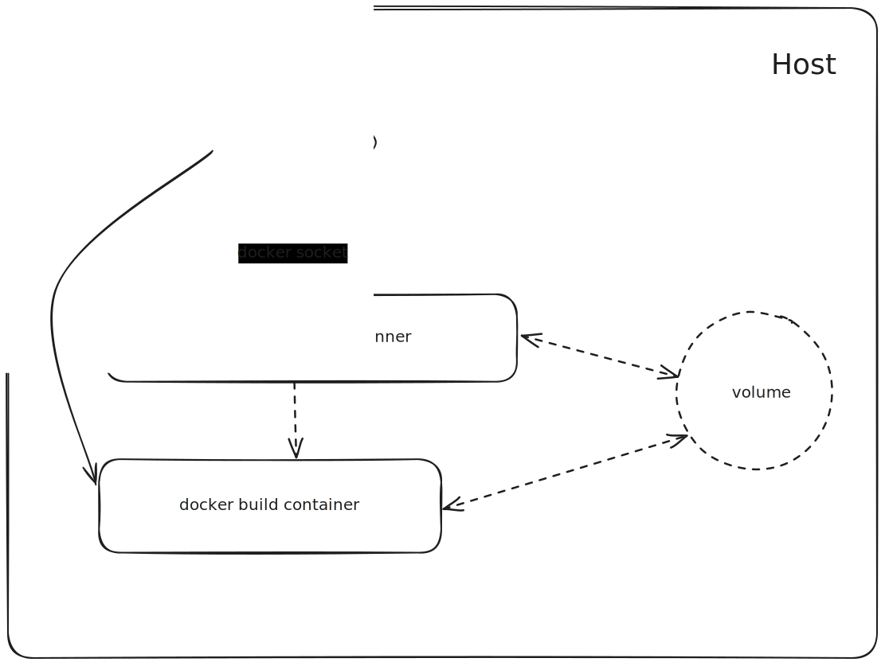

# Github Runner Container Hooks

> A Github Runner Container Docker Hook for DooD based on [actions/runner-container-hooks](https://github.com/actions/runner-container-hooks/tree/main/packages/docker)

## What is this about?

This is a custom [runner container hook](https://docs.github.com/en/actions/hosting-your-own-runners/managing-self-hosted-runners/customizing-the-containers-used-by-jobs#triggering-the-customization-script) that can be used to execute docker containers in containerized self hosted runner environments. It is meant to be used in a [Docker-out-of-Docker](http://tdongsi.github.io/blog/2017/04/23/docker-out-of-docker/) scenario (docker socket sharing) and addresses the issue of runner context sharing. With a DooD setup it is not posible to share the github runner context (workspace) with the docker runner container since the containers are created by the host:

## Usage

## How it works
